# VxMail — Production VPS Hosting & Email Routing Architecture

This guide details the complete deployment, DNS configuration, and email routing architecture for hosting VxMail under the **`vxmusic.in`** ecosystem on any cloud VPS (DigitalOcean, Hetzner, AWS EC2, Linode, OVH, or Contabo).

---

## 1. Complete DNS Configuration Matrix (`vxmusic.in`)

Configure these DNS records at your domain registrar or DNS manager (Cloudflare, Route53, Namecheap, etc.):

| Record Type | Host / Name | Value / Destination | TTL / Priority | Purpose |
| :--- | :--- | :--- | :--- | :--- |
| **A** | `mail.vxmusic.in` | `YOUR_VPS_IP` | Automatic | Primary mail host & web client IP |
| **A** | `vxmusic.in` | `YOUR_VPS_IP` | Automatic | Apex domain pointing |
| **MX** | `@` (or `vxmusic.in`) | `mail.vxmusic.in` | Priority `10` | Inbound email routing to your VPS |
| **TXT (SPF)** | `@` (or `vxmusic.in`) | `v=spf1 mx ip4:YOUR_VPS_IP ~all` | Automatic | Authorizes your VPS to send mail for `@vxmusic.in` |
| **TXT (DKIM)** | `vxmail2026._domainkey` | `v=DKIM1; k=rsa; p=<PUBLIC_KEY>` | Automatic | Cryptographic signature verifying tamper-free dispatch |
| **TXT (DMARC)**| `_dmarc` | `v=DMARC1; p=quarantine; rua=mailto:dmarc@vxmusic.in; pct=100` | Automatic | Protects domain reputation & prevents spoofing |
| **PTR (rDNS)** | *Configured in VPS panel* | `mail.vxmusic.in` | — | **Crucial**: Prevents Gmail/Outlook marking mail as spam |

> [!IMPORTANT]
> **Reverse DNS (PTR Record)**: Most mail providers (Google, Microsoft, Yahoo) immediately reject SMTP connections if the sending IP's reverse DNS doesn't match the hostname. In your VPS provider dashboard (e.g. DigitalOcean "Networking" -> "PTR", or Hetzner "Reverse DNS"), set the PTR for `YOUR_VPS_IP` to `mail.vxmusic.in`.

---

## 2. Inbound & Outbound Email Routing Flow

```mermaid
flowchart TD
    subgraph Inbound Routing ["Inbound Email Flow"]
        A[External Sender e.g. artist@gmail.com] -->|SMTP Port 25| B[Stalwart Mail Server]
        B -->|SPF, DKIM & DMARC Verification| C{Valid Sender?}
        C -->|Yes| D[Inbound Pipe / Webhook]
        C -->|No| E[Reject / Spam Folder]
        D -->|HTTP POST /api/mail/inbound| F[Next.js Inbound Router]
        F -->|Resolve Alias / Mailbox| G[(PostgreSQL)]
        F -->|Attach to Thread| G
        F -->|Broadcast Event| H[Redis Pub/Sub & SSE Bus]
        H -->|Server-Sent Events| I[User Browser Real-time UI]
        I -->|Instant Sound / Toast| J[Inbox Stream Auto-updates]
    end

    subgraph Outbound Routing ["Outbound Email Flow"]
        K[User Compose Modal] -->|HTTP POST /api/mail/send| L[Next.js Outbound Handler]
        L -->|Verify Sender Alias| M[(PostgreSQL)]
        L -->|Enqueue Dispatch| N[BullMQ Redis Worker]
        N -->|SMTP Submission 587 STARTTLS| O[Stalwart / Relay]
        O -->|DKIM Signing with vxmail2026 key| P[External Recipient]
    end
```



---

## 3. Email Alias & Mailbox Routing

VxMail routes addresses dynamically through the PostgreSQL database:

1. **Primary Mailboxes**:
   - `alex@vxmusic.in` -> Routes directly to Alex Rivera's primary inbox.
2. **Role & Team Aliases**:
   - `support@vxmusic.in` -> Configured as an alias to the support team mailbox.
   - `hello@vxmusic.in` -> General contact alias.
   - `sync@vxmusic.in` -> Licensing & music placement alias.
3. **Catch-All (Optional)**:
   - Any unknown address `@vxmusic.in` can be routed to an administrative quarantine or catch-all inbox configured in the Admin Console.

---

## 4. One-Click VPS Deployment Instructions

### Prerequisites
- A VPS with **Ubuntu 22.04 LTS or Debian 12**
- At least **2 GB RAM** and **1 vCPU**
- Port `25` unblocked by your hosting provider (Hetzner, Linode, Contabo, or OVH allow port 25 upon request)

### Step-by-Step Deployment

1. **SSH into your VPS**:
   ```bash
   ssh root@YOUR_VPS_IP
   ```

2. **Clone your repository**:
   ```bash
   git clone https://github.com/your-username/vxmail.git /opt/vxmail
   cd /opt/vxmail
   ```

3. **Configure Environment Variables**:
   Copy `.env.example` to `.env` and set your secure passwords:
   ```bash
   cp .env.example .env
   nano .env
   ```

4. **Run the Automated Deploy Script**:
   ```bash
   chmod +x ./infrastructure/vps/deploy.sh
   ./infrastructure/vps/deploy.sh
   ```

   The script will automatically:
   - Configure UFW firewall rules for ports `22`, `80`, `443`, `25`, `465`, `587`, and `993`.
   - Install Docker & Docker Compose.
   - Generate 2048-bit DKIM private and public keys.
   - Obtain SSL certificates via Let's Encrypt for `mail.vxmusic.in`.
   - Spin up PostgreSQL, Redis, Stalwart, MinIO, Next.js Web App, BullMQ Worker, and Nginx.
   - Run Prisma migrations and seed the database.

5. **Verify Services**:
   ```bash
   docker compose -f ./infrastructure/vps/docker-compose.prod.yml ps
   ```

---

## 5. Real-time Architecture Specifications

- **Server-Sent Events (SSE)**: Connected at `/api/events` with zero proxy buffering (`X-Accel-Buffering: no`).
- **Cluster Synchronization**: Redis Pub/Sub synchronizes email arrivals across multiple server instances or worker threads.
- **Client Auto-Reconnect**: Frontend maintains a self-healing connection with exponential backoff and instant inbox reactivity.
